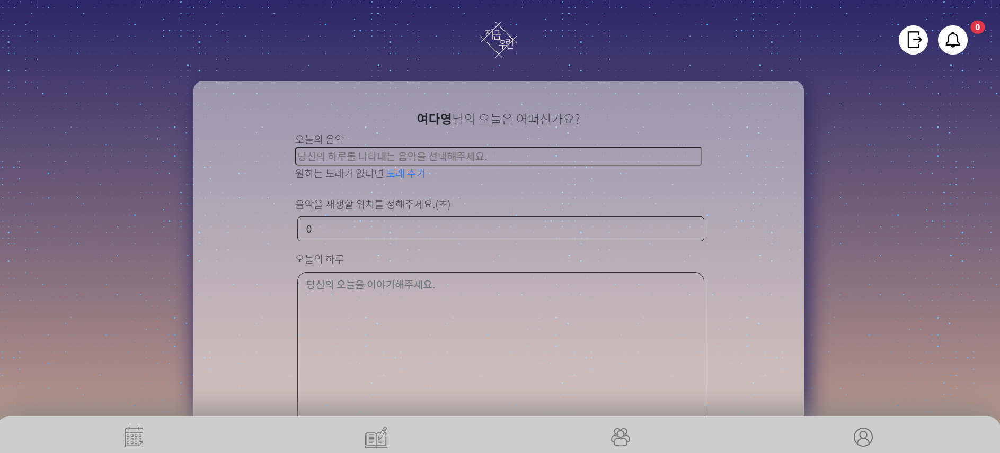
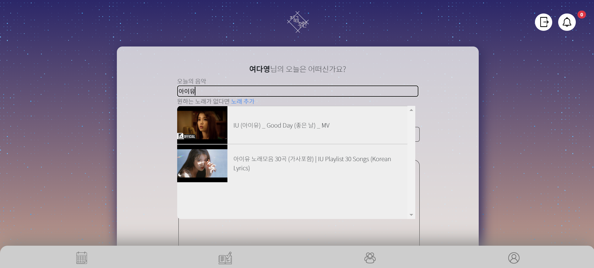
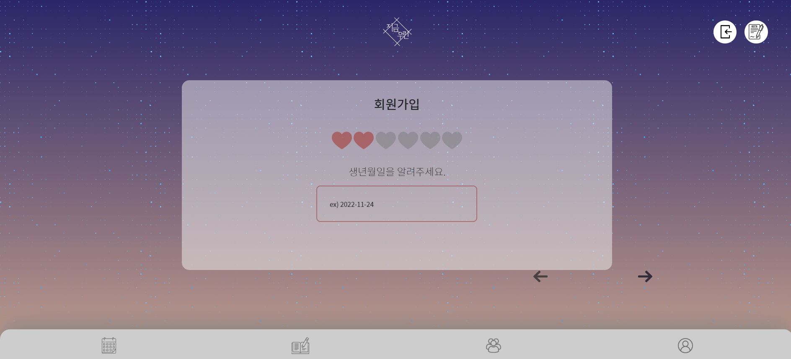
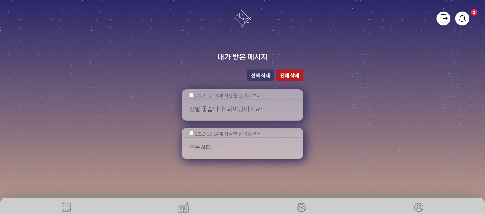

# 💌 지금, 우린

> **프로젝트명 : 지금, 우린**
> 
> **팀명 : 중요한건 꺾이지 않는 마음. (unbreakable heart.)**
> 
> **주제 : 음악과 함께하는 나만의 일기장**
> 
> **프로젝트 기간 : 11월 23일 ~ 12월 14일**

 

## 💌 '지금, 우린' 기획 의도

- 익명성을 강조한 나만의 음악 일기장
- 음악과 함께 그날의 감정을 기록하고, 타인과 그 감정을 공유함
- 유저의 입장에서 생각하고 최소한으로 필요한 기능만 구현

 

## 💌 AWS를 통한 배포

👉 **[사이트 바로가기](http://unbreakableheart-env.eba-fq3y3emz.ap-northeast-2.elasticbeanstalk.com/)**

 

## 💌 프로젝트 참여자들

`프론트엔드` : 박찬솔, 여다영

`백엔드` : 김재형, 문상희, 손희준

 

## 💌 '지금, 우린' 기능 소개

### [메인 페이지]

- PC와 모바일 모두 사용이 편리하도록 nav바 조정
- 시각적으로 알아보기 편하게 nav바에 글자를 최대한 이용하지 않음
- 로그인 하지 않았을 때 웹 서비스 설명과 로그인 이동 버튼이 올라오도록 CSS 로 화면 구현
- 로그인 시에는 내가 쓴 게시글만 모아보도록 설정

 

### [일기장 CRUD]

- **생성**

- 오늘의 음악 - DB에 미리 저장되어 있는 유튜브 주소를 불러와서 음악을 추가 할 수 있게 구성함
- 만약 오늘의 음악에서 저장된 DB가 내가 찾는 음악이 없다면, **노래추가**를 통해서 유튜브에서 직접 노래를 찾아서 영상을 추가할 수 있음
- 유튜브 영상을 직접 가져오는 방법을 사용하기 때문에 음악재생할 위치를 정해줘서 바로 음악이 나오게 추가 할 수 있음
- 금지어 설정을 통해서 욕설이나 기타 써서는 안될 말들을 걸러내게 구성함(위 사진 참고)
- 윈도우즈 기본 이모지를 사용하여 글 감정 표현을 추가함
- 이미지 추가 가능
- 공개/비공개를 통해 나 혼자 볼 일기는 비공개, 모두와 공유하고 싶은 글은 공개를 통해 글로써 익명의 누군가와 소통할 수 있게 설정

 

- **음악** 

- 노래 데이터 추가
  - 유튜브에서 음악 검색하여 검색 결과물 6개까지 보여줌.
  - 노래 추가 클릭하여 영상 제목을 제목, 썸네일, 영상길이, 영상주소 모델에 추가

- 노래 선택 하여 글정보에 추가

 

- **생성 화면**

- 음악을 재생, 일시정지, 정지시키는 버튼 만들어 음악 키고 끄도록 구현
- 글에 공감 표현 비동기로 구현
- 댓글과 댓글에 대한 대댓글 비동기로 구현
  - 대댓글은 본인은 작성 불가

- 게시물 신고 기능 구현
- 글 쓴 유저가 아닐경우
  - 글 신고 기능 구현
  - 메세지 신고 기능 구현

 

### [캘린더]

- 로그인 된 상태일 때, 자신의 캘린더를 띄움

  - 일기를 쓰지 않은 날일 때는, '작성한 일기가 없다'는 문구를 띄우고
  - 일기를 쓴 날에는, 작성한 일기들을 볼 수 있는 페이지로 넘어감

  => 비동기로 구현함

- 해당 일자의 일기들을 총 네가지로 구분하여 출력
  - 글만 있는 경우
  - 글과 사진이 있는 경우
  - 글과 노래가 있는 경우
  - 글과 사진, 노래 모두 있는 경우
- grid를 활용하여 작은 화면 일 때는 오른쪽 div가 아래로 내려가도록 함

 

### [커뮤니티]

- 다른 사람들의 공개 글과 내용을 확인 할 수 있으며 공감을 할 수 있음
- 글자 수가 많다면 … 으로 표시 되게 만듬
- 사진 크기로 출력되게 구현했으며, 사진 없이 또는 음악 없이 올라온 게시글에는 통일감을 주기 위해 너비를 같게 만들었음

 

### [로그인/회원가입]

- **로그인**

- 카카오 API를 활용해서 카카오 소셜 로그인 기능 구현

 

- **회원가입**

- 자바스크립트를 활용해 한번에 정보를 입력받고 제출함

- 하트 색으로 단계를 나타내줌

- 입력을 덜한 채로 다음 단계를 넘어가려 하면, 박스가 빨간색으로 변함

 

### [마이페이지]

- 로그인 시 회원가입 했던 개인정보를 바탕으로 Profile Card를 구현
- 마우스 호버 하면 반대쪽 면이 보이도록 CSS로 구현
- 수정, 탈퇴, 비밀번호 변경 버튼으로 자신의 개인정보 수정 가능하도록 기능 구현

 

- **메세지**

- 내가 받은 메시지를 선택 삭제 혹은 전체 삭제 기능 구현

- 메시지 디테일에서 메시지 내용확인 및 노래 재생 기능 구현

- 메시지 신고 기능 구현 - 3회 이상 신고 받으면 자동 정지

- 네브바에 아직 읽지 않은 메세지 수 표시 기능 구현

 

## 💌 사용한 기술 스택

        

 

## 💌 프로젝트 후기

- **김재형** : 서비스에 중점을 두고 진짜 서비스에 필요한 기능으로만 구성해서 지난 프로젝트들과는 다르게 진짜 서비스를 준비한다는 느낌을 받았다. 좋은 팀원들을 만나 많이 배우고 팀원들과 회의를 자주 진행한 덕에 의견 조율과 의사소통에 큰 도움이 되었다. 처음에 css파일 정리에 대한 규칙을 정하지 못한 부분 등 아쉬운 부분이 없는 건 아니지만 그럼에도 이번 프로젝트는 앞으로의 다른 프로젝트들을 함에 있어서 큰 도움이 될 거란 확신이 든다.
- **문상희** : 유저간 상호작용을 최소화하도록 기획하여  작업 볼륨이 부족하지 않을까 걱정했는데 걱정과 달리 시간이 크게 남지 않아 기획을 성공적으로 했구나라는 성취감을 느꼈습니다. 글에 공감을 하는 기능은 구현했지만 글이 공감을 받았다는것을 구현하지 못해서 아쉬웠습니다. 막히는 부분이 생기면 팀원들이 서로 도와 문제를 해결해나가 작업이 원활하게 진행된거 같습니다.  열심히 참여해준 모든 팀원들에게 감사를 전하고 싶습니다.
- **박찬솔** : 단순히 평가용이 아닌 소비자들의 입장에서 웹 서비스 구현을 했습니다. 이전 프로젝트와 다르게 실제 사용자들에게 배포 후 테스트를 하고 보완하고 개선 작업을 했습니다. 모든 것에 만족 하지만 내 실력이 팀원들 실력을 못따라가서 아쉬움이 많이 남았습니다. 좋은 팀원들을 만나 프로젝트 기간 동안 많이 배웠으며 이 경험을 토대로 웹 서비스를 작업한다면 더욱 퀄리티가 높은 결과물이 나올 것 같습니다.
- **손희준** : 유튜브가 아닌 음악 전문플렛폼으로 연결했으면 어땠을까 하는 아쉬움은 남으나 "음악을 통한 일기"라는 명제는 잘 구현했다고 봄. 처음으로 선택했던 열정형이였는데 매일 밤에 만나서 작업하는 시간을 가졌는데, 생각했던 것보다 더 힘들었지만, 같이 작업했던 팀원들이 다들 열심히 하고 그랬기에 더 힘이 났다고 생각함. 우리팀원들 너무너무 고생 많았고 다들 화이팅입니다^^
- **여다영** : 우리가 개발해보고 싶은 서비스를 직접 기획하고, 그 의도에 맞추어 유저의 입장에서 생각하고 개발하여서 더욱 뜻깊었다. 최종 프로젝트인 만큼 기능을 이것저것 넣고 싶은 마음도 있었지만, 사용자가 가장 편리한 방법이 무엇일까 고민하면서 꼭 필요한 기능만 넣었던 적은 이번이 처음이었던 것 같다. 또, 앱처럼 만들고 싶다는 마음에서 반응형으로 만들고, 프론트엔드를 맡은 적은 처음이었어서 재미있었다.